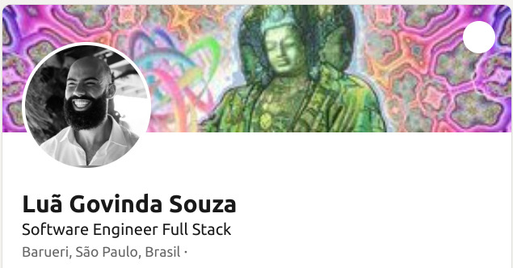

# Profile

## Documentation

* [README] Manual[^4]
* [README] Diagramas[^5]
* [README] Lista de emojis[^6] 

## How to update header and footer? (Como atualizar o header e o footer?)

?????????????????????[PAREI AQUI]??????????????????

## Social Media

[  linkedin](https://github.com/govinda777)

[  github](https://github.com/govinda777)

[  github](https://github.com/govinda777)

## Social Media Less

* [linkedin] profile: https://www.linkedin.com/in/govinda777/
* [linkedin] recent activity : https://www.linkedin.com/in/govinda777/recent-activity/
* [govindas-tech-talk] recommended courses: 

## Social Media Less With Imgs

## Experiência 

### Release Train Engineer by Approvata

* [^4]: [[README] Manual](https://docs.github.com/pt/get-started/writing-on-github/getting-started-with-writing-and-formatting-on-github/basic-writing-and-formatting-syntax#links)
* [^5]: [[README] Diagramas](https://mermaid-js.github.io/mermaid/#/?id=diagram-types)
* [^6]: [[README] Lista de emojis](https://github.com/ikatyang/emoji-cheat-sheet/blob/master/README.md#face-smiling)